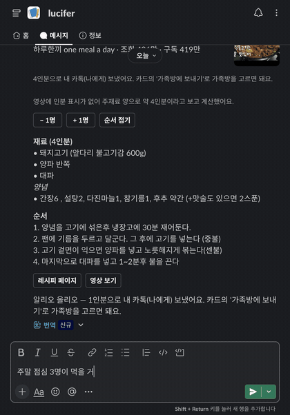
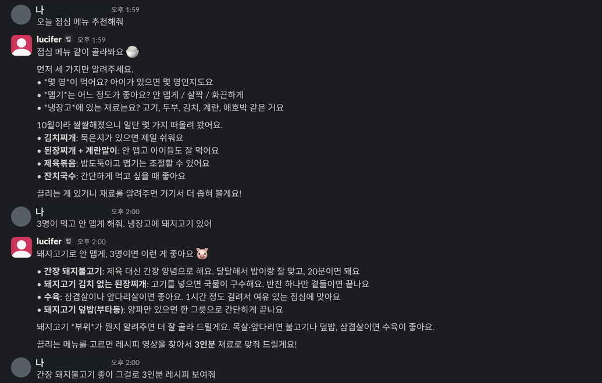
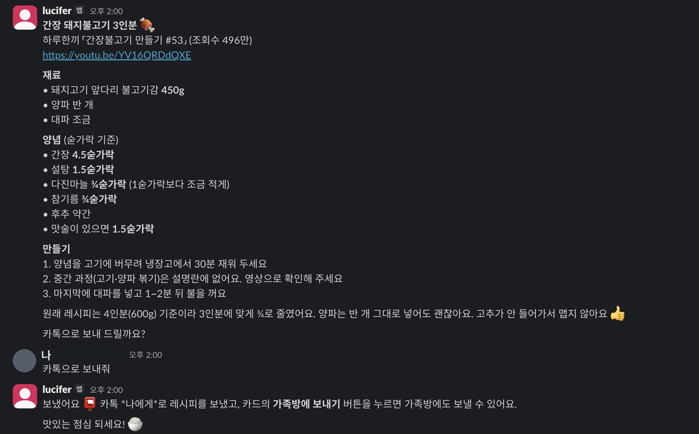
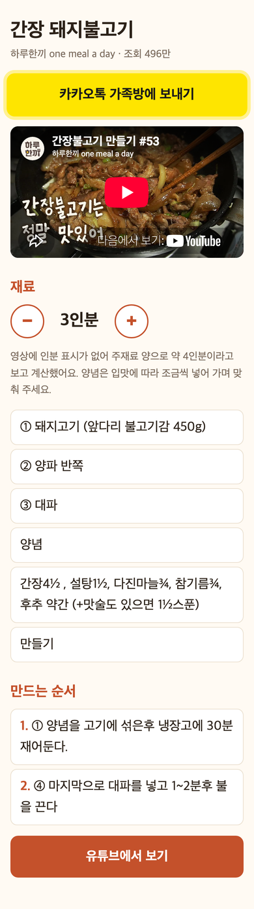
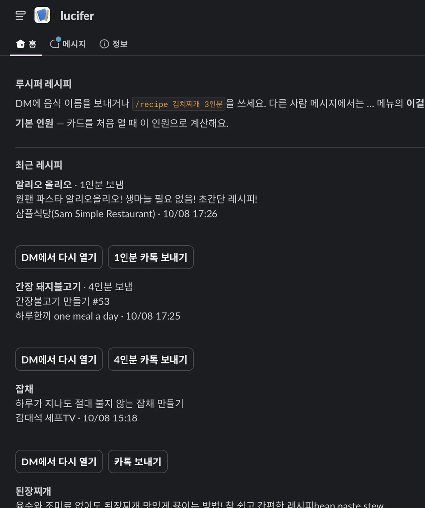

# recipe-bot — 먹고 싶은 걸 말하면, 레시피가 카톡으로

> "먹고 싶은 게 있다고 하면 자동으로 유튜브에서 젊은 사람들이 좋은 레시피와 준비물, 조리법 등을 가져와서 카톡으로 어머니에게 보낸다던지"

Slack에서 봇 '루시퍼'에게 말을 걸면, 메뉴를 같이 고르고 YouTube 레시피 영상을 찾아 인원에 맞춘 재료를 카톡으로 보내 주는 저만을 위한 사이드 프로젝트입니다.

> 코드는 공개하지 않습니다. 이 저장소는 판단과 제약만 적은 README입니다.

| 항목 | 내용 |
|:--|:--|
| 기간 | 2026-10-07 ~ 10-08 (커밋 19개, v2 포함) |
| 역할 | 개인 프로젝트 — 설계·구현·운영 (사용자 1인) |
| 스택 | 서버리스 함수(Cloudflare Workers 무료), YouTube Data API 무료 할당, 카카오 메시지 API, Slack 앱, 구독형 Claude Code CLI + MCP, launchd |
| 상태 | 운영 중 |

## 맥락

Slack 봇에 "커피"라고 멘션하면 주문까지 해 주는 사례를 보고 시작했습니다. 그걸 보고 정리한 생각은 이렇습니다.

> "입구랑 실행으로 내가 반복적으로 하는 일들을 자동화할 수 있다는 거잖아."

입구는 이미 손에 있는 Slack입니다. 남은 문제는 실행이었습니다. 레시피를 고르고, 분량을 맞추고, 카톡으로 보내는 일입니다.

## 제약

- **종량제 API 키를 쓰지 않습니다.** 모델은 이미 쓰는 구독 안에서만 씁니다.
- **월 추가 비용 0원.** 서버는 무료 서버리스 하나뿐입니다.
- **Mac이 꺼져 있어도 기본 기능은 돌아야 합니다.**

## 실제 대화

v1 대화 캡처

카톡 '나에게'로 온 카드를 누르면 열리는 레시피 페이지입니다. 휴대폰에서 −/+로 인원을 바꾸면 재료와 순서의 분량이 다시 계산됩니다.

## 흐름

1. **입구** — Slack DM 메시지를 서버리스 함수가 받습니다.
2. **대화** — Mac이 켜져 있으면 Mac의 구독형 Claude가 대화를 맡아 메뉴를 같이 좁힙니다. 꺼져 있으면 음식 이름만 알아듣는 규칙 방식으로 돌아가고, 인분은 버튼으로 고릅니다.
3. **레시피** — 조회수와 구독자 수로 영상을 고르고, 설명란에서 재료·순서를 코드로 뽑습니다.
4. **분량** — 고른 인원에 맞춰 숫자에 비율을 곱합니다.
5. **전송** — 레시피 카드를 제 카톡 '나에게'로 보냅니다. 가족방에는 카드의 공유 버튼으로 보냅니다.

## 단계별 판단

**① 레시피는 모델 없이 뽑습니다.** 5개 메뉴의 상위 영상 40개를 먼저 재 봤습니다. 메뉴마다 재료가 적힌 설명란이 3개 이상 있었고, 60초 이하 쇼츠는 전부 재료가 없었습니다. 판단: 설명란을 규칙으로 읽고, 쇼츠는 거르고, 조리 순서가 없으면 영상 링크로 대신합니다.

**② 기준 인분은 추정하고, 추정했다고 밝힙니다.** 인원에 맞추려면 원래 몇 인분인지 알아야 합니다. 설명란에 인분이 적힌 건 35개 중 4개, 자막은 15개 중 0개였습니다. 판단: 주재료 양으로 추정합니다(고기 150g·면 100g·닭 400g = 1인분). 화면에는 "적힌 값"인지 "추정"인지 함께 보여 줍니다. 시간(10~20분), 길이(20cm), 가짓수(3가지), 영상 챕터 시각은 곱하지 않습니다.

**③ 가족 단톡방은 사람이 한 번 누릅니다.** 개인이 단톡방에 글을 올리는 공식 API가 없습니다. 맥 카톡 화면 자동화를 시험했는데, 방 열기까지는 됐지만 목록 순서가 바뀌어 다른 방이 한 번 열렸습니다. 판단: 잘못된 방에 보낼 위험보다 탭 두 번이 낫습니다. 카드에 공식 공유 버튼을 붙였습니다.

**④ 자연스러운 대화는 Mac이 켜져 있을 때만 합니다.** 규칙 방식은 "오늘 점심 메뉴 추천해줘"를 음식 이름으로 오해했습니다. 대화가 되려면 모델이 필요한데, 종량제 키는 쓰지 않기로 했습니다. 구독으로 모델을 쓰는 길을 하나씩 봤습니다. 챗 앱에 커넥터를 붙이는 길은 계정 권한이 잠겨 있었습니다. CI나 무료 VM에서 구독 CLI를 돌리는 길은 약관과 운영 부담이 컸습니다. 판단: Mac에 이미 로그인된 구독 CLI가 대화를 맡고, 레시피 검색·분량 계산·전송은 MCP 도구로 서버가 맡습니다. Mac이 꺼지면 규칙 방식으로 돌아갑니다. 같은 대화는 30분 동안 이어집니다.

**⑤ "Mac이 켜져 있나"는 강한 일관성 저장소로 판단합니다.** Mac 에이전트가 3초마다 작업을 묻고, 그 호출 자체를 생존 신호로 씁니다. 처음 쓰던 키-값 저장소는 읽기를 최대 60초 캐시해서, 1분 전 상태로 판단하게 됩니다. 판단: 상태 저장소를 강한 일관성 쪽(Durable Object)으로 바꿨습니다. Mac이 15초 안에 작업을 가져가지 않으면 규칙 방식이 대신 답합니다.

## 결과

- Slack DM 4턴 대화(메뉴 추천 → 인원·입맛 → 3인분 레시피 → 카톡 전송), 턴마다 30초 안에 답이 왔고 카톡 도착까지 확인했습니다(2026-10-08).
- 추가 비용 0원. 서버리스 무료 플랜과 무료 API 할당 안에서 돕니다.

## v2 — 써 보고 고친 것 (2026-10-08)

> "만드는 순서가 이상하다." "이것도 인원수에 따라 변화가 안됌." "할루시네이션 검증해야함."

**⑥ 순서는 원문 그대로 뽑습니다.** 조리 동사로 순서 줄을 추측하다 보니 "(중불)"로 끝나는 단계가 빠지고, "추가해도 좋아요"를 구독 독려 문구로 보고 잘랐습니다. 판단: 머리줄, 1부터 차례로 느는 번호 묶음, 문단 순으로 찾고 소제목과 팁을 따로 둡니다. 12개 메뉴 설명란 47개에 두 모델이 원문만 보고 따로 정답을 만들었고, 거기에 대면 단계 재현이 126에서 166/191로, 원문에 없는 가짜 단계가 47에서 2개로 바뀌었습니다.

**⑦ 인원은 말로 쓴 분량과 메모까지 따라갑니다.** "양파 반쪽", "물 1컵 반", 카톡 메모의 "3인분, 810g"이 인원을 바꾸면 같이 바뀝니다. "팬 한쪽으로" 같은 방향 말은 그대로 둡니다.

**⑧ 모델이 쓴 수치는 코드가 대조합니다.** 모델이 레시피에 없는 "달걀 3개", "간 사과 ¼개"를 덧붙였습니다. 판단: 코드로 뽑은 레시피 수치를 기준으로 답의 수치를 대조합니다. 가족에게 가는 메모에 없는 수치가 있으면 보내지 않습니다. Slack 답은 한 번 고쳐 쓰게 하고, 그래도 남으면 답 아래에 밝힙니다. 모델이 스스로 낸 값에는 "(제안)", 요청받은 조정에는 "(요청 반영)"을 달면 통과합니다.

**⑨ 판단은 문서에, 대조는 코드에 둡니다.**

> "코드로 다 세팅 해놓으면 agent의 장점을 잘 활용하지 못하는거 같아서"

말투, 대화 순서, 표시 규칙은 문서 한 장으로 옮겼습니다. 문서를 고치면 다음 메시지부터 바뀝니다. 설명란에서 순서를 못 뽑으면 모델이 원문을 직접 읽습니다. 수치 대조와 Mac이 꺼졌을 때의 규칙 방식은 코드로 남겼습니다. 대조할 기준까지 모델이 만들면 대조가 되지 않기 때문입니다.

**⑩ 결과는 Slack 안에서 누릅니다.** 답 아래 카드에 썸네일, 인원 −/+, 다른 영상, 순서 펼치기, 확인 후 카톡 보내기, 메모 입력 창을 답니다. `/recipe` 명령과 메시지 단축키 "이걸로 레시피 찾기"도 붙였습니다. 카드의 인원과 펼침 상태는 버튼 값에 싣습니다. 키-값 저장소는 읽기를 최대 60초 캐시해서, 버튼을 연달아 누르면 옛 값이 나오기 때문입니다. 워크플로 단계도 만들었지만 조직 단위 설치가 필요해 꺼 두었습니다.

**⑪ 다시 먹고 싶은 건 홈에서 한 번에 보냅니다.**

> "이거 맛있더라고 생각하면 또 물어볼 필요없이 클릭해서 바로 또 보낼 수 있으니까"

앱 홈 탭에 최근 레시피 10개를 둡니다. 각 줄의 "카톡 다시 보내기"는 확인 한 번으로 같은 인원 그대로 다시 보냅니다. 기본 인원도 홈에서 정해 두면 인원 버튼에 미리 표시됩니다. 대화가 필요 없는 일은 대화로 시작하지 않습니다.

v2 이후 대화에서 루시퍼가 설명란 원문을 읽고 "도구는 2인분이라고 했지만 원문은 1인분"이라고 먼저 바로잡았습니다. 원인이던 "2인분 하실 때" 안내 줄은 기준 인분으로 읽지 않게 고쳤습니다.

## 이 문서에 없는 것

코드, 서버 주소, 키, 카톡 카드 화면, 가족 정보.
